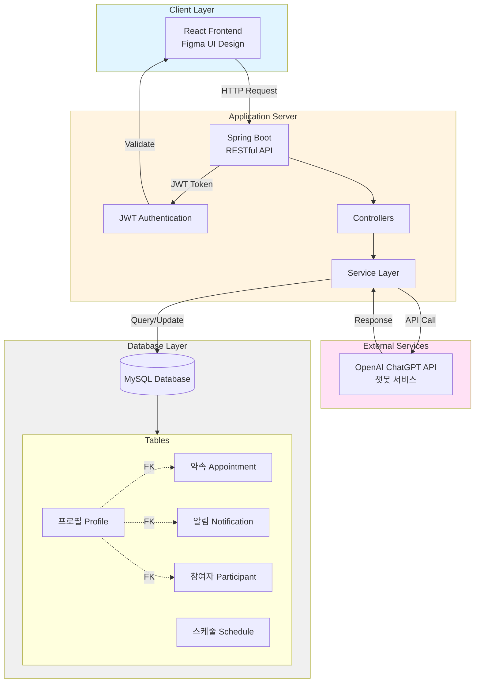

# 🏠 스마트경로당 (Smart Senior Center)

> 6-70대 노년층을 위한 직관적인 약속 관리 서비스 플랫폼

<br/>

## 📋 목차
- [프로젝트 소개](#-프로젝트-소개)
- [주요 기능](#-주요-기능)
- [기술 스택](#-기술-스택)
- [시스템 아키텍처](#-시스템-아키텍처)
- [데이터베이스 설계](#-데이터베이스-설계)
- [실행 방법](#-실행-방법)

<br/>

## 🎯 프로젝트 소개

### 개발 배경
디지털 기기 사용에 어려움을 겪는 계층을 위해, 간편하고 직관적인 UI로 약속 일정을 관리할 수 있는 서비스를 제공합니다.

### 주요 특징
- 🎨 **간편하고 직관적인 UI**: 대형 버튼과 명확한 색상 구분
- 📱 **쉬운 약속 관리**: 복잡한 절차 없이 클릭 몇 번으로 약속 생성
- 🧠 **치매 예방 효과**: 정기적인 일정 관리를 통한 인지 능력 향상
- 🤖 **AI 챗봇 지원**: ChatGPT 기반 질의응답 서비스
- 🎮 **미니게임**: 사용자 참여를 유도하는 재미 요소

### 개발 기간
2024년 12월 ~ 2025년 1월 (2개월)

### 팀 구성
6인 팀 (백엔드 3명, 프론트엔드 3명)

<br/>

## ✨ 주요 기능

### 1️⃣ 회원 관리
- 회원가입 및 로그인
- JWT 기반 인증 시스템
- 마이페이지 (프로필 조회 및 수정)
- 비밀번호, 전화번호 변경 기능

### 2️⃣ 약속 관리
- **약속 생성**: 날짜, 시간, 장소 선택하여 약속 만들기
- **약속 참여**: 생성된 약속에 참여 신청
- **인원 제한**: 최대 인원 설정 및 현재 인원 관리
- **약속 상태 관리**
  - 🟢 확정 (최대 인원 충족 시)
  - 🔴 파토 (약속 삭제 시)
- **약속 삭제**: 생성자만 삭제 권한 보유
- **멤버 조회**: 확정된 약속의 참여자 전화번호 조회

### 3️⃣ 알림 시스템
- 약속 확정/파토 알림
- 일정 리마인더

### 4️⃣ 부가 기능
- **AI 챗봇**: OpenAI ChatGPT API 기반 질의응답
  - 주변 병원 위치, 영업시간 등 정보 제공
- **미니게임**
  - 랜덤 숫자 맞추기
  - 거꾸로 가위바위보

<br/>

## 🛠 기술 스택

### Backend


### Frontend


### Tools & External API


<br/>

## 🏗 시스템 아키텍처



<br/>

## 🗄 데이터베이스 설계

### 주요 테이블 구조

#### 📌 Profile (프로필)
```sql
- user_id (PK)
- username
- password
- phone_number
- created_at
```

#### 📌 Appointment (약속)
```sql
- appointment_id (PK)
- creator_id (FK → Profile.user_id)
- title
- location
- date_time
- max_participants (최대 인원)
- current_participants (현재 인원)
- status (모집중/확정/파토)
```

#### 📌 Participant (참여자)
```sql
- participant_id (PK)
- appointment_id (FK → Appointment.appointment_id)
- user_id (FK → Profile.user_id)
- joined_at
```

#### 📌 Notification (알림)
```sql
- notification_id (PK)
- user_id (FK → Profile.user_id)
- message
- is_read
- created_at
```

#### 📌 Schedule (스케줄)
```sql
- schedule_id (PK)
- user_id (FK → Profile.user_id)
- appointment_id (FK → Appointment.appointment_id)
- reminder_time
```

### 테이블 관계
- `Appointment`, `Notification`, `Participant` 테이블은 `Profile` 테이블의 `user_id`를 외래키로 참조
- `Participant` 테이블은 `Appointment` 테이블의 `appointment_id`를 외래키로 참조

<br/>

## 📱 주요 화면

### 홈 화면
- 서비스 소개 (Introduce 메뉴)
- 약속 잡기 버튼
- 게임 메뉴

### 약속 관리
- 약속 생성 폼 (날짜, 시간, 장소 선택)
- 약속 리스트 (참여 가능한 약속 조회)
- 참여자 조회 (확정된 약속의 멤버 전화번호)

### 마이페이지
- 프로필 정보 조회
- 내가 만든 약속
- 참여한 약속
- 프로필 수정 (비밀번호, 전화번호)

### 챗봇
- 주변 정보 질의응답
- 병원, 약국 등 위치 및 영업시간 조회

### 미니게임
- 랜덤 숫자 맞추기 게임
- 거꾸로 가위바위보 게임

<br/>
